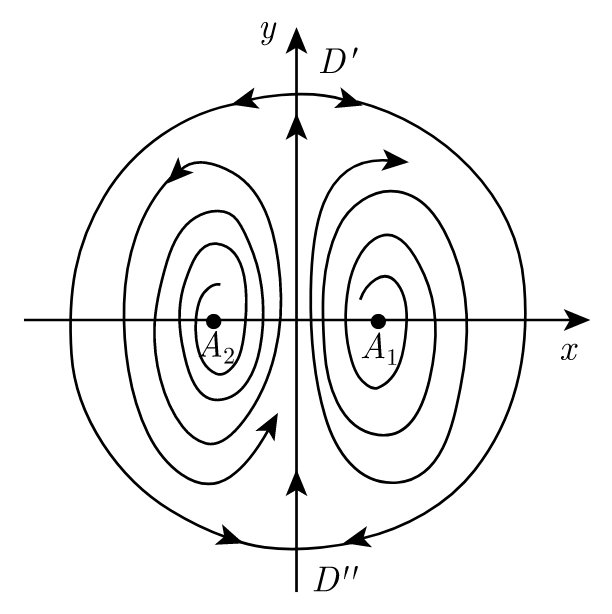

# Global analysis

$$
\newcommand{\bx}{\boldsymbol x}
\newcommand{\bX}{\boldsymbol X}
\newcommand{\by}{\boldsymbol y}
\newcommand{\bu}{\boldsymbol u}
\newcommand{\bv}{\boldsymbol v}
\newcommand{\bw}{\boldsymbol w}
\newcommand{\bF}{\boldsymbol F}
\newcommand{\bP}{\boldsymbol P}
\newcommand{\bV}{\boldsymbol V}
\newcommand{\bJ}{\boldsymbol J}
\newcommand{\bf}{\boldsymbol f}
\newcommand{\bg}{\boldsymbol g}
\newcommand{\be}{\boldsymbol e}
\newcommand{\bphi}{\boldsymbol \phi}
\newcommand{\bxi}{\boldsymbol \xi}
\newcommand{\bA}{\boldsymbol A}
\renewcommand{\Re}{\mathrm{Re}}
\renewcommand{\Im}{\mathrm{Im}}
\newcommand{\bB}{\boldsymbol B}
\newcommand{\bC}{\boldsymbol C}
$$

We have learned some topics about the behavior of dynamical systems as $t \to +\infty$, and many of them was under the framework when the orbit is bounded. Even for simple linear dynamical systems, the solution becomes unbounded and trend to infinity via some direction. Our next task is to analyze the limiting behavior far, far away from the origin.

An obvious difficulty of discussing what happens at infinity is, obviously, we cannot compute the derivative or even evaluate the function at $\bx = \infty$. Even the notion of $\bx = \infty$ is ambiguous: in $\R ^1$ there is obvious $+\infty$ and $-\infty$, but in $\R ^2$ there are "infinitely many" $\infty$'s. Similar as the one-dimensional case, our first attempt is to classify them based on the "direction" from which infinity is reached. First, we need to pull the infinity close to a unit circle, using the following idea of Poincaré.

## Poincaré hemisphere

To bring the inifinity closer, we put the phase plane $\R ^2$ into $\R ^3$, above a unit sphere. Define $\tilde \bx = (\bx, 1) = (x _1, x _2, 1)$. It is now a point in the plane $x _3 = 1$. Now we project it to the unit sphere:

$$
	\bX = \boldsymbol \psi (\bx) := \frac{\tilde \bx}{\abs{\tilde \bx}} = \frac{(x _1, x _2, 1) ^\top}{\sqrt{x _1 ^2 + x _2 ^2 + 1}}.
$$

The plane is mapped to the upper hemisphere 

$$S _+ = \set{(X _1, X _2, X _3) \in \R ^3: X _1 ^2 + X _2 ^2 + X _3 ^2 = 1, X _3 > 0}.$$

The infinities from each direction is now points on the equator. One can then change the dynamical system of $\bx$ into a dynamical system in $\bX$. If $\bx = \bu (t)$ is a solution, then $\boldsymbol U = \boldsymbol \psi \circ \bu$ solves

$$
	\boldsymbol U' (t) = (\boldsymbol \psi \circ \bu)' (t) = \grad \boldsymbol \psi (\bu (t)) \bu' (t).
$$

In particular, to compute $\nabla \boldsymbol \psi$, note that 

$$
	\grad (\abs{\tilde \bx} \boldsymbol \psi (\bx)) = \grad \tilde \bx = \begin{pmatrix}
		1 & 0 \\
		0 & 1 \\
		0 & 0
	\end{pmatrix}.
$$

By chain rule, 

$$
	\grad (\abs{\tilde \bx} \boldsymbol \psi (\bx)) = \abs{\tilde \bx} \grad \boldsymbol \psi (\bx) + \boldsymbol \psi (\bx) \grad \abs{\tilde \bx} = \abs{\tilde \bx} \grad \boldsymbol \psi (\bx) + \boldsymbol \psi (\bx) \frac{\tilde \bx ^\top}{\abs{\tilde \bx}} \grad \tilde \bx.
$$

So 

$$
\begin{align*}
	\abs{\tilde \bx} \grad \boldsymbol \psi (\bx) &= \grad \tilde \bx - \bX \bX ^\top \grad \tilde \bx.
\end{align*}
$$

If we denote $\bX _{1, 2} = (\bX _1, \bX _2) = \boldsymbol \psi _{1, 2} (\bx)$ to be the first two coordinates of $\bX$, then 

$$
\begin{align*}
	\abs{\tilde \bx} \grad \boldsymbol \psi _{1, 2} (\bx) &= \Id - \bX _{1, 2} \bX ^\top _{1, 2}.
\end{align*}
$$

Finally, note that 

$$
	\abs{\bX _{1, 2}} = \pth{\frac{x _1 ^2 + x _2 ^2}{1 + x _1 ^2 + x _2 ^2}} ^\frac12 = \pth{1 - \frac1{\abs{\tilde \bx} ^2}} ^\frac12.
$$

So we can express $\frac1{\abs{\tilde \bx}} = \pth{1 - \abs{\bX _{1, 2}} ^2} ^\frac12$ and $\tilde \bx = \frac{\bX _{1, 2}}{(1 - \abs{\bX _{1, 2}} ^2) ^\frac12}$. Therefore

$$
	\grad \boldsymbol \psi _{1, 2} = \pth{1 - \abs{\bX _{1, 2}} ^2} ^\frac12 \pth{\Id - \bX _{1, 2} \bX _{1, 2} ^\top}.
$$

Therefore, if we denote $\bv (t) = \boldsymbol \psi _{1, 2} (\bu (t))$ to be the first two coordinate of $\boldsymbol U (t)$, then $\bv (t)$ solves 

$$
\begin{align*}
	\bv' (t) &= \grad \boldsymbol \psi _{1, 2} (\bu (t)) \bu' (t) \\
	&=  (1 - \abs{\bv (t)} ^2) ^\frac12 (\Id - \bv (t) \bv (t) ^\top) \bf (\bu (t)) \\
	&= (1 - \abs{\bv (t)} ^2) ^\frac12 (\Id - \bv (t) \bv (t) ^\top) \bf \pthf{\bv (t)}{(1 - \abs{\bv (t)} ^2) ^\frac12}.
\end{align*}
$$

This is a dynamical system inside a unit disk, which is called the Poincaré disk. We would like to plot the phase portrait of this dynamical system. 

> [!Remark] 
> When $\abs{\bv (t)} \ll 1$, $\bv' (t) \approx \bf (\bv (t))$. So the phase portrait near the origin is similar to the phase portrait of the original system. Away from the origin, from the matrix $(1 - \abs{\bv (t)} ^2) ^\frac12 (\Id - \bv (t) \bv (t) ^\top)$, we see that the vectors are shrinking at a rate of $(1 - \abs{\bv (t)} ^2) ^\frac32$ in the radial direction, and shrinking at a rate of $(1 - \abs{\bv (t)} ^2) ^\frac12$ in the tangential direction. If the Jacobian becomes a zero matrix or an infinity, we should accelerate/decelerate $\bf$ to analyze its behavior at infinity.

## Analysis at infinity

Neither the hemisphere nor the disk is the easiest to analyze the stability in terms of computation. We can improve this by the following. For a unit vector $\be$ on the equator, we project one half of the hemisphere in the $\be$ direction to the plane $\bX \cdot \be = 1$. Then $\bX$ is mapped to $\boldsymbol Y$ determined by

$$
	\boldsymbol Y = \frac{\boldsymbol X}{\boldsymbol X \cdot \be}.
$$

For instance, when $\be = (1, 0, 0) ^\top$ we map half hemisphere to the upper half plane $X _1 = 1$:

$$
	\boldsymbol Y = \frac{\bX}{X _1} = \frac{(x _1, x _2, 1) ^\top}{x _1}.
$$

Define new variables $u, z$ by 

$$
	u = \frac{x _2}{x _1}, z = \frac{1}{x _1}.
$$

Then the mapping $(x _1, x _2) \to (u, z)$ is called the Poincaré transform. 

Similarly, we can apply mapping 

$$
	u = \frac{x _1}{x _2}, z = \frac1{x _2}
$$

to analyze the behavior near $\be _2$.

> [!Example]
> Consider the dynamical system
> 
> $$
> \begin{cases}
> \displaystyle
> 	\dfr xt = 2 x y \\
> \displaystyle
> 	\dfr yt = 1 + y - x ^2 + y ^2
> \end{cases}
> $$
> 
> First, we look for critical points. From 
> 
> $$
> 	2x y = 1 + y - x ^2 + y ^2 = 0
> $$
> 
> we have either $x = 0$ or $y = 0$ from the first equation. Plug into the second we find that $x = 0$ does not have any critical point and $y = 0$ corresponds to $x = \pm 1$. So critical points are $\bx _1 = (-1, 0) ^\top$ and $\bx _2 = (1, 0) ^\top$. 
> 
> Take Jacobian
> 
> $$
> 	\grad \bf (x, y) = \begin{pmatrix}
> 		2 y & 2 x \\
> 		-2 x & 2 y + 1
> 	\end{pmatrix}, \qquad
> 	\grad \bf (\bx _1) = \begin{pmatrix}
> 		0 & -2 \\
> 		2 & 1
> 	\end{pmatrix}, \qquad
> 	\grad \bf (\bx _2) = \begin{pmatrix}
> 		0 & 2 \\
> 		-2 & 1
> 	\end{pmatrix}.
> $$
> 
> Both have positive determinant and negative discriminant. Thus they are both unstable focal points. Further investigation reveals that orbits near $\bx _1$ are counterclockwise and near $\bx _2$ are clockwise.
> 
> Next, we look at closed orbits. Note that $x = 0$ is invariant and $\dfr yt = 1 + y + y ^2 > 0$ on $y$-axis. Thus the $y$-axis is an orbit with upward direction. Note that 
> 
> $$
> 	\div \bf (x, y) = 4 y + 1.
> $$
> 
> It takes some trials but we can use the Dulac function $B(x, y) = \dfrac1{x ^2}$ to show that there is no limit cycle in either the right half plane or the left half plane. This also shows there are no singular closed orbits.
> 
> Lastly, we look for critical points at infinity. First we use Poincaré transform to map the right half plane $X > 0, Z = 1$ to upper half plane $X = 1, Z > 0$ by 
> 
> $$
> 	u = \dfrac{y}{x}, \qquad z = \dfrac{1}x \qquad x = \dfrac1z, \qquad y.= \dfrac uz.
> $$
> 
> By chain rule, 
> 
> $$
> \begin{cases}
> \displaystyle
> 	\dfr zt = -\frac1{x ^2} \dfr xt = -2\frac yx = -2u, \\
> \displaystyle
> 	\dfr ut = y \dfr zt + z \dfr yt = -2 u y + z (1 + y - x ^2 + y ^2) = \frac1z \pth{-2 u ^2 + z ^2 + z u - 1 + u ^2}
> \end{cases}
> $$
> 
> We need to study the behavior near the equator. We now decelerate by setting $t = z \tau$, then 
> 
> $$
> \begin{cases}
> \displaystyle
> 	\dfr z\tau = -2uz, \\
> \displaystyle
> 	\dfr u\tau = -u ^2 + z ^2 + z u - 1.
> \end{cases}
> $$
> 
> On the equator, $z = 0$, so $\dfr u \tau = -u ^2 - 1 < 0$. There are no critical points.
> 
> Then, we use Poincaré transform to map the upper half plane $Y > 0, Z = 1$ to upper half plane $Y = 1, Z > 0$ by 
> 
> $$
> 	u = \dfrac xy, \qquad z = \dfrac 1y \qquad y = \dfrac 1z, \qquad x = \dfrac uz.
> $$
> 
> By a similar chain rule,
> 
> $$
> \begin{cases}
> \displaystyle
> 	\dfr zt = -\frac1{y ^2} \dfr yt = -z ^2(1 + y - x ^2 + y ^2) = -z ^2 - z + u ^2 - 1, \\
> \displaystyle
> 	\dfr ut = x \dfr zt + z \dfr xt = x (-z ^2 - z + u ^2 - 1) + 2 x = \frac uz (-z ^2 - z + u ^2 + 1).
> \end{cases}
> $$
> 
> Again, we decelerate by setting $t = z \tau$, and then we have 
> 
> $$
> \begin{cases}
> \displaystyle
> 	\dfr z\tau = -\frac1{y ^2} \dfr yt = -z ^2(1 + y - x ^2 + y ^2) = z (-z ^2 - z + u ^2 - 1), \\
> \displaystyle
> 	\dfr u\tau = x \dfr zt + z \dfr xt = x (-z ^2 - z + u ^2 - 1) + 2 x = u (-z ^2 - z + u ^2 + 1).
> \end{cases}
> $$
> 
> On the equator, $z = 0$, so $\dfr z\tau = 0$, and $\dfr u \tau = u (u ^2 + 1)$.  Critical point are $(u, z) = (0, 0)$. Jacobian at it is 
> 
> $$
> 	\grad _{u, z} \begin{pmatrix}
> 	 u (-z ^2 - z + u ^2 + 1) \\
> 	 z (-z ^2 - z + u ^2 - 1)
> 	\end{pmatrix} = \begin{pmatrix}
> 		-z ^2 - z + 3 u ^2 + 1 & -(2z - 1) u \\
> 		2 u z & -3z ^2 - 2 z + u ^2 - 1
> 	\end{pmatrix}
> $$
> 
> At the origin, Jacobian is $\begin{pmatrix}1 & 0 \newline 0 & -1\end{pmatrix}$ so it is a saddle point. Stable direction is $(0, 1) ^\top$ and unstable direction is $(1, 0) ^\top$. 
> 
> We conclude that on the Poincaré sphere, there is a saddle point at $\bX = (0, 1, 0) ^\top$, which corresponds to $\bX _{1, 2} = (0, 1) ^\top$ on Poincaré disk. It is stable from the radial direction and unstable from the tangential direction. Similarly, we can find another saddle point at $(0, -1) ^\top$ which is unstable from the tangential direction and stable from the radial direction. This can also be seen from the saddle point on the $Y = 1$ plane, since it is also mapped to the origin, and its neighborhood is mapped to the lower half plane. The stable and unstable direction exchanged because the time transform $t = z \tau$ is now time reversal, sinze $z < 0$. 
> 
> In summary, we can compose the following global phase portrait.
> 
> 

